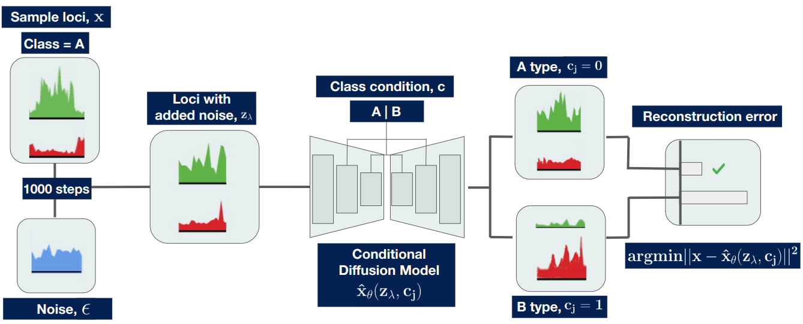

# TECSAS-Diffusion

TECSAS-Diffusion (TD) is a diffusion classifier model to predict relationships between chromating types and 1D epeginetic datasets

# Training

At the time there are 2 trained models that you can run for predictions, one trainned on the odd chromosomes of the GM12878  (hg19) using 115 tracks, which included RNASeq, Histone modifications and Transcription Factors, and ran predictions on the the even chromosomes of the GM12878 (hg19)

And another one trained with only histone modification tracks (H2AFZ, H3K27ac, H3K27me3, H3K36me3, H3K4me1, H3K4me2, H3K4me3, H3K79me2, H3K9ac, H3K9me3, H4K20me1. Both yieldeding good results, though the histone-only approach specifically improved accuracy for B compartments.

# Requirements

* PyMEGABASE

`pip install -i https://test.pypi.org/pypi/ --extra-index-url https://pypi.org/simple PyMEGABASE==1.0.13`

* numpy
* matplotlib
* scikit-learn
* seaborn
* torch
